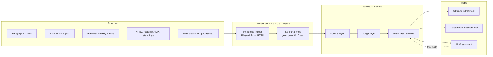

# Fantasy Baseball Platform Roadmap

A three-phase plan: (1) finish a really solid in-season tool, (2) automate, (3) learn AI engineering by building an LLM assistant on top of what you already have. Quick wins first; Process Book concepts baked in; resume-relevant tech choices (Prefect, Iceberg, DuckDB, CI/CD, data quality) called out as we go.

---

## Progress as of 2026-04-26

**Shipped (merged to master):**

- **Phase 1a Lineup Optimizer v1 + v2** — greedy Monday-lock and Friday-weekend-lock optimizers in [`apps/in-season-tool/app.py`](apps/in-season-tool/app.py) + [`apps/in-season-tool/lineup_optimizer.py`](apps/in-season-tool/lineup_optimizer.py), backed by new mart [`dbt/models/main/mart_weekly_lineup_inputs.sql`](dbt/models/main/mart_weekly_lineup_inputs.sql), new Razzball weekend source/stage models, and new seed [`dbt/seeds/league_roster_slots.csv`](dbt/seeds/league_roster_slots.csv).
- **Phase 1a v3 (MILP) — deferred** by user decision. Greedy is good enough in ~90% of cases; revisit only if edge cases accumulate.
- **Phase 1b iteration 1 (FAAB Remaining + UI polish)** — new seed [`dbt/seeds/faab_remaining.csv`](dbt/seeds/faab_remaining.csv), `my_faab_remaining` / `high_bid_pct_of_faab` in [`mart_faab_worksheet.sql`](dbt/models/main/mart_faab_worksheet.sql), `% of Budget` emoji-coded column, FTN status arrow prefix on player names, `Your FAAB` metric card, FAAB UI hidden for nolen_50, `README.md` manual-maintenance table.
- **Phase 1b — cross-league FTN (manual, app-only):** small expander in FAAB Worksheet with 12T↔15T mental scaling heuristics; **no** dbt `effective_high_bid` or `ftn_bid_scaling` seed. Automated derivation plan is cancelled; see [`docs/plans/cross-league_faab_rec_derivation_266474f4.plan.md`](docs/plans/cross-league_faab_rec_derivation_266474f4.plan.md) (archived as superseded).
- **Phase 1f NFBC 50 wiring** — league_config row, `50s` format in roster slots + ROS value selector, app supports it end-to-end for lineup decisions. The cut-list tab for 50s rolls up into Phase 1e.
- **Local dbt dev loop** — `dbt parse` / `dbt compile` runnable locally via [`dbt/profiles.yml`](dbt/profiles.yml) + [`requirements-dev.txt`](requirements-dev.txt); full builds still in dbt Cloud.

**Next branch (recommended):** Phase 1c — SP streamer / two-start planner (largest remaining in-season feature gap for pitcher decisions).

**Upcoming order of attack after that:**

1. Phase 1e cut candidate tool (weekly decision the app still doesn't help with).
2. Phase 1g dbt hygiene (tests + pre-commit + docs site) — good offseason-prep work.
3. Phase 1d standings-aware value — parked until Phase 2b headless standings ingestion lands, unless manually seeded.
4. Phase 2 automation once Phase 1 is solid.

---

## Current state (what you already have going for you)

- dbt medallion on Athena + Iceberg: [`dbt/models/source`](dbt/models/source), [`dbt/models/stage`](dbt/models/stage), [`dbt/models/main`](dbt/models/main)
- Per-format SGP valuations (OC / ME / 50s) in [`dbt/models/stage/projections`](dbt/models/stage/projections), anchored by [`dbt/models/stage/nfbc/stg_nfbc_sgp_factors.sql`](dbt/models/stage/nfbc/stg_nfbc_sgp_factors.sql)
- FAAB worksheet mart [`dbt/models/main/mart_faab_worksheet.sql`](dbt/models/main/mart_faab_worksheet.sql) and weekly projections mart [`dbt/models/main/mart_weekly_projections.sql`](dbt/models/main/mart_weekly_projections.sql)
- In-season Streamlit app [`apps/in-season-tool/app.py`](apps/in-season-tool/app.py)
- Manual S3 upload util [`utils/upload_folder_to_s3.py`](utils/upload_folder_to_s3.py)
- League config seed [`dbt/seeds/league_config.csv`](dbt/seeds/league_config.csv) (OC, Cash 12, OCQ, Cash 15 — NFBC 50 not yet wired)

Gaps we'll address: no automation, no dbt tests / docs site, no NFBC 50 path in the app, no weekly lineup / SP streamer / standings-aware valuation, no AI layer.

---

## Architecture target (end state of Phase 2, before AI)

---

## Phase 1 — Make the in-season tool excellent (weeks, not months)

Goal: every Sunday evening you open this app, make smarter decisions than the field, and never touch a spreadsheet.

### 1a. Weekly lineup optimizer (the big new feature)

New mart: `mart_weekly_lineup_recommendations`. For each of my rostered hitters in the selected league, produce projected category contributions for the current lineup window, then solve the lineup.

NFBC has **two weekly lineup lock points** (Monday AM and Friday AM), and they need different data because the Monday-issued Fri–Sun projection goes stale by Friday (injuries, lineup changes, confirmed SPs). We use one Razzball file per lock window:

- **Mon–Sun (Monday lock)** — full-week [`data/razzball/projections/weekly/hitting/hittertron.csv`](data/razzball/projections/weekly/hitting/hittertron.csv). Columns: `Wk of`, `Opps`, `#G`, `HG`, `AG`, `vR`, `vL`, `$`, `$/G`, `$ MT` (Mon–Thu), `$ FS` (Fri–Sun), `ROS12 $/G`, `RFS12`, `RFS15`, `NFBCID`.
- **Fri–Sun (Friday lock)** — fresh weekend [`data/razzball/projections/weekly/weekend_hitting/hittertron.csv`](data/razzball/projections/weekly/weekend_hitting/hittertron.csv). Columns: `Fri` (start date), `FRI ST%`, `Opp`, `SP` (per-date opposing starters with handedness, e.g. `4/17|RFeltner(R) 4/18|JHerget(R)`), `#G`, `HG`, `AG`, `vR`, `vL`, `$`, `G`, `NFBCID`. The `SP` column is better platoon signal than the aggregated `vR`/`vL` in the weekly file.

Data plumbing:

- Add a new Glue source `razzball.weekly_hitting_weekend` partitioned by `year/month/day` like the existing source.
- New source model `src_razzball_projections_weekend_hitting.sql` and stage model `stg_razzball_proj_weekend_hitting_per_pa.sql` paralleling the existing full-week pair.
- Extend [`mart_weekly_projections.sql`](dbt/models/main/mart_weekly_projections.sql) (or fork a `mart_weekend_projections.sql`) to carry both files; add a `lineup_window` column ∈ {`mon_sun`, `fri_sun`} so the optimizer can filter to the right window.
- New stage model `stg_razzball_weekend_sp_matchups.sql` to explode the `SP` column into one row per (NFBCID, date, opposing_sp_name, opposing_sp_hand) — feeds matchup logic for v3.

New inputs still needed (no subscription changes):

- **Probable pitchers grid** — already downloaded at [`data/fangraphs/probables/roster-resource__probables-grid.xlsx`](data/fangraphs/probables). Add source + stage model to expand to one row per (team, date, opposing_sp, hand). Overlaps with the weekend `SP` column; we'll use Razzball first because it ties directly to NFBCID, and fall back to the Fangraphs grid for validation.
- **NFBC lineup slots / roster rules** — new seed `league_roster_slots.csv` (C, 1B, 2B, 3B, SS, MI, CI, OF×5, UTIL, SP, RP, P, bench counts per format).

Optimizer logic (start simple, iterate):

- v1 (Monday lock): greedy fill per slot by `$` from the full-week file, respecting position eligibility from `pos`.
- v2 (Friday lock): re-run the same optimizer against the **weekend file** to set the Fri–Sun lineup with fresh data. Two separate recommendation sets in the app, one per lock window. This is the specific feature the weekend data enables.
- v3: MILP via `pulp` or `mip` to maximize sum(`$`) subject to slot constraints; add platoon logic using the exploded weekend `SP` matchups (hitter handedness vs opposing SP hand per game) instead of the aggregated `vR`/`vL` count.

App tab "Lineup": a window toggle (Mon–Sun / Fri–Sun), recommended starters, benched with reason ("fewer games", "bad platoon vs Feltner/Herget", "no games Fri"), and a diff against my current NFBC-reported lineup.

### 1b. Tighten the FAAB worksheet (quick wins on what's already there)

- Add Process Book FAAB taxonomy columns to [`mart_faab_worksheet.sql`](dbt/models/main/mart_faab_worksheet.sql): `bid_bucket` in {triage, tactical, strategic}, derived from FTN `type` + `ros_value` + own_pct deltas.
- Add `bid_price_bucket` in {min, in-between, breaker} so you instantly see danger-zone bids.
- Surface a **proactive adds** flag: RoS value > threshold AND rostered% rising AND cheap FTN low-bid (Process Book "bid proactively, not reactively").
- Add a per-league **FAAB remaining** metric (requires new source: weekly FAAB standings export from NFBC; 1 new raw file, 1 new dbt source model).
- UI polish in [`apps/in-season-tool/app.py`](apps/in-season-tool/app.py): color code bid buckets; add "budget remaining" header; collapse owner filter default to Free Agent + Me.

### 1c. SP streaming / two-start planner

- New mart `mart_sp_streamer` joining Razzball `streamonator.csv` ([`data/razzball/projections/weekly/pitching`](data/razzball/projections/weekly/pitching)) with the probables grid.
- Tag each start with (home/away, opponent offense quality from aggregated opponent wOBA vs handedness from pybaseball later), and flag two-start weeks.
- Process Book confidence-weighting: downweight Sunday starts, upweight Monday starters; expose a `two_start_confidence` score.
- App tab "SP Streamer": free-agent SPs sorted by weekly $ with two-start boost, with a toggle for "keep ratios safe" (cap projected ERA/WHIP).

### 1d. Standings-aware value

- New source: weekly NFBC standings snapshot per league (you already have [`src_nfbc_standings.sql`](dbt/models/source/nfbc/src_nfbc_standings.sql) — extend to include my league's live snapshot).
- New mart `mart_marginal_category_value`: for each of my rostered and free-agent players, compute projected contribution × **marginal points** (how many standings points does +1 HR / +1 SB / -0.01 ERA move me right now). This is the Process Book late-season contextual-value idea.
- Blend: `context_value = 0.5 * global_ros_$ + 0.5 * marginal_$_for_my_team`, with a slider in the app.
- This is the single feature that compounds the most as the season progresses.

### 1e. Cut candidate tool

- New mart `mart_cut_candidates`: for my rostered players, score = f(RoS $, weekly $, roster%, IL/DTD status from FTN). Apply the two Process Book gates: "would I start him?" (answer from lineup optimizer) and "would anyone re-add him?" (proxy: roster% < X% AND RoS $ < replacement).
- App tab "Drop List" ranked worst → best on my roster with one-click justifications.

### 1f. NFBC 50 mode

- Extend [`dbt/seeds/league_config.csv`](dbt/seeds/league_config.csv) with a row for NFBC 50 (format=`50s`, no FAAB).
- Add an NFBC 50 roster source (you have [`data/nfbc/in-season-players/nolen_50.csv`](data/nfbc/in-season-players) already).
- Show only the lineup optimizer + cut tool tabs for that league; hide FAAB/SP-streaming pickups but keep SP start/sit.

### 1g. Data quality / dbt hygiene (resume-relevant, cheap to add)

- Add `dbt tests`: `not_null` and `unique` on IDs across every source/stage model; `relationships` between marts and the ID map.
- Add `dbt-expectations` or custom generic tests for numeric ranges (e.g. projected ERA between 1 and 10).
- Turn on dbt docs generation; host the static site on S3 behind CloudFront or just commit to `gh-pages` — a link in your README is a strong resume signal.
- Add a `pre-commit` config with `sqlfmt` + `dbt-checkpoint`.
- Fix the current "where hit.nfbcid is not null or pitch..." pattern in [`mart_weekly_projections.sql`](dbt/models/main/mart_weekly_projections.sql) with a cleaner `mart_eligible_players` CTE.

**Exit criteria Phase 1:** you make every in-season decision (FAAB, lineup, streamer, drop) inside this app for all four league types.

---

## Phase 2 — Automate (so you stop babysitting the pipeline)

### 2a. Orchestrate with Prefect on AWS ECS Fargate

Direct resume alignment with the Nationals JD at [`context/WashingtonNationalsDataEngineer.md`](context/WashingtonNationalsDataEngineer.md) (Prefect + ECS Fargate + Iceberg). If you're career-targeting baseball ops, pick **Prefect over Airflow**.

- New top-level `flows/` folder:
  - `flows/ingest_razzball_weekly.py`, `flows/ingest_ftn_faab.py`, `flows/ingest_fangraphs_projections.py`, `flows/ingest_nfbc_rosters.py`, `flows/build_dbt.py`.
- Each flow: download → write to a tempdir → upload via existing [`utils/upload_folder_to_s3.py`](utils/upload_folder_to_s3.py) → trigger dbt build → run dbt tests → post a Slack/Discord webhook with a summary.
- Deploy: Prefect Cloud free tier + ECS Fargate work pool. One Terraform module in `infra/` for ECR repo, task role, Fargate work pool, secrets in AWS Secrets Manager. Terraform experience is explicitly called out in the JD.

### 2b. Headless ingestion where possible

Per source, in order of easiest to hardest:

- **NFBC rosters / ADP / standings**: NFBC has stable CSV/TSV download URLs for logged-in users. A requests session with cookies in Secrets Manager is usually enough — no browser needed. First thing to automate.
- **Razzball**: Streamonator (weekly), Hittertron weekly **and** weekend versions are public HTML tables; `pandas.read_html` or `httpx` + `lxml` works. Schedule on two cadences: weekly Monday-morning pull for Streamonator + weekly Hittertron; Friday-morning pull for weekend Hittertron.
- **Fangraphs**: auth-gated CSV exports for projections. Playwright headless with saved auth state; run weekly.
- **FTN**: same pattern — Playwright with saved cookies. FTN updates FAAB recs Sun/Mon; schedule accordingly.
- Fallback for any login that breaks: keep the manual upload flow working; the flow just alerts instead of failing silently.

### 2c. CI/CD

- GitHub Actions workflow `.github/workflows/ci.yml`: `dbt parse`, `dbt compile`, `sqlfmt --check`, `ruff`, `pytest` for Python utils.
- A second workflow that builds + pushes the Prefect flow Docker image to ECR on merges to main.
- Branch protection + PR previews (small but looks professional).

### 2d. Observability

- Central log of what was ingested when (new Iceberg table `meta.ingest_audit` populated by every flow).
- `dbt source freshness` on every source; alert if stale.
- A Streamlit "Pipeline Health" page that reads `meta.ingest_audit` and last dbt run timestamps. Five lines of code, big professionalism signal.

**Exit criteria Phase 2:** Sunday night you open the app and the data is already there without you doing anything, or you get a Discord/Slack ping telling you exactly which manual file to grab.

---

## Phase 3 — AI engineering, learning-first, LLM-agent track

You said: go slow, understand. So this phase is deliberately structured as **lessons that each ship a working feature**. Every module is ~1–2 weekends of work and ends with something in the app.

### Module 0: Foundations (read, don't code)

- Simon Willison's LLM blog + the Anthropic "tool use" docs + the Claude Agents / MCP spec. ~4 hours.
- Pick a model provider: start with Anthropic Claude via API (good tool use, cheap enough) or local via Ollama if you want to learn the full stack.

### Module 1: Read-only Q&A over your marts (classic RAG + text-to-SQL)

Goal: "Who are the top 5 free-agent OFs in my OC league this week?" answered correctly.

- New package `apps/assistant/`.
- Pattern: LLM given a catalog of your mart schemas + a few-shot examples → generates Athena SQL → you execute → return rows + LLM summary.
- Teaches: prompt engineering, schema-as-context, why RAG ≠ magic, basic evals.
- Guardrails lesson: only allow `SELECT` on `dbt_main.*`; block everything else. Write this yourself; it's ~30 lines and is *the* lesson in production LLM safety.

### Module 2: Structured tool use (function calling)

Goal: replace brittle text-to-SQL with named tools: `get_faab_worksheet(league)`, `get_lineup_recommendation(league, week)`, `get_cut_candidates(league)`, `get_standings(league)`.

- Each tool is a thin wrapper around your existing marts.
- LLM decides which tool to call and with what args. You'll see immediately why this is more reliable than free-form SQL.
- Teaches: JSON schemas for tools, multi-turn tool loops, token budgeting.

### Module 3: Agentic reasoning for decisions

Goal: "Given my team, my standings, and this week's FAAB list, what should I bid on and what should I drop?" — a reasoned answer grounded in the Process Book principles.

- Add a **Process Book knowledge tool**: chunk the PDFs in [`context/TheProcessBook`](context/TheProcessBook), embed with `text-embedding-3-small` or `bge-small`, store in local Chroma or DuckDB VSS. The agent can cite "Process Book, FAAB Procedure" in its answers.
- System prompt encodes your preferences (risk tolerance, league priorities) from a new `assistant/profile.yaml`.
- Teaches: retrieval augmentation, prompt hierarchies, why chain-of-thought outputs need evals.

### Module 4: Evals (the most overlooked skill)

Goal: you don't ship an agent you can't measure.

- Hand-label 20–30 historical week decisions you've made (bid/drop/start). Replay them through the agent and score agreement + reasoning quality.
- Use `promptfoo` or `langsmith` or roll your own 40-line scorer.
- Teaches: offline evals, regression testing prompts, the iteration loop that actually matters in AI work.

### Module 5 (stretch): MCP server

- Expose your marts as an MCP server so Claude Desktop / Cursor can use them. Matches what Cursor/Anthropic are pushing in 2026 and is a genuinely novel resume line.
- Teaches: the protocol layer; this is where data engineering and AI engineering intersect.

**Deliberately NOT in this phase yet:** fine-tuning, custom model training, local GPU. Those are Phase 4 if you're still interested; most of the value of the Process Book lives in prompts + retrieval, not in weights.

---

## Sequencing summary

1. **Next 2 weeks:** 1a v1 + v2 (Mon-lock greedy lineup optimizer against full-week file, Fri-lock greedy against weekend file)
2. **Weeks 3–4:** 1a v3 (MILP with per-game platoon from exploded weekend `SP` column)
3. **Weeks 5–6:** 1b (FAAB tightening) + 1c (SP streamer)
4. **Weeks 7–8:** 1d (standings-aware), 1e (cut list), 1f (NFBC 50 mode)
5. **Week 9:** 1g (tests, docs site, pre-commit)
6. **Weeks 10–13:** Phase 2 (Prefect + headless ingestion + CI + observability)
7. **Season-end / offseason:** Phase 3 AI modules 1–4, one per 1–2 weekends
8. **Offseason stretch:** Module 5 MCP + revisit ML projections track if still interesting

---

## Division of responsibility

**You handle (all AWS console / infra work, for now):**

- Creating new Glue tables and updating Glue schemas (e.g. the new `razzball.weekly_hitting_weekend` source)
- S3 bucket / prefix creation and any bucket policy changes
- IAM roles, policies, and access key rotation
- Athena workgroups and query-result bucket configuration
- (Later) ECS Fargate setup, Secrets Manager entries, CloudFront, DynamoDB tables
- Running `aws` CLI or Terraform `apply` commands

**I handle (code in this repo only):**

- dbt models (source / stage / main), seeds, tests, docs
- Python code in `apps/`, `flows/` (later), `utils/`
- Streamlit UI
- `.sql`, `.py`, `.yml`, `.md`, `.csv` seed files
- Writing Terraform `.tf` files for your review — but not applying them

**Workflow when new AWS resources are needed:**

1. I'll write a short "AWS changes needed" block with the exact Glue DDL, S3 path, or IAM snippet, plus a 1-paragraph why
2. You review, apply in the console (or run the CLI command I provide), and confirm
3. I then write/run the dbt + Python code that depends on it

## Git workflow

- Default branch is `master`. **No direct commits to `master`** — ever.
- Every unit of work ships on a feature branch. Branch naming: `feat/<phase>-<short-description>` (e.g. `feat/1a-lineup-optimizer-v1`, `feat/1a-weekend-hittertron-source`, `feat/1b-faab-bid-buckets`). Use `fix/...` for bug fixes and `chore/...` for hygiene (tests, docs, pre-commit).
- One branch per meaningful chunk of the plan — usually one sub-phase or one deliverable within a sub-phase. I'll propose the branch name at the start of each chunk so you can veto it.
- I'll create the branch, commit to it, and push it. I will **not** open the PR or merge — you do both, so you get a review checkpoint every time.
- Commits only happen when you explicitly ask ("commit this" / "push this"). Otherwise I leave the working tree dirty so you can review first.
- If I need to pick up where a previous feature branch left off, I'll branch from the merged `master` (after you've merged), not stack branches.

## Things I'll explicitly NOT do in this plan

- Change dbt layout (it's good — stick with source/stage/main)
- Migrate off Athena/Iceberg (it's on-target for the Nationals JD and works)
- Build a draft tool (you said the focus is in-season)
- Ship an AI feature before Phase 1 is usable — the agent is only as good as the marts underneath it
- Touch AWS directly (see Division of responsibility above)
